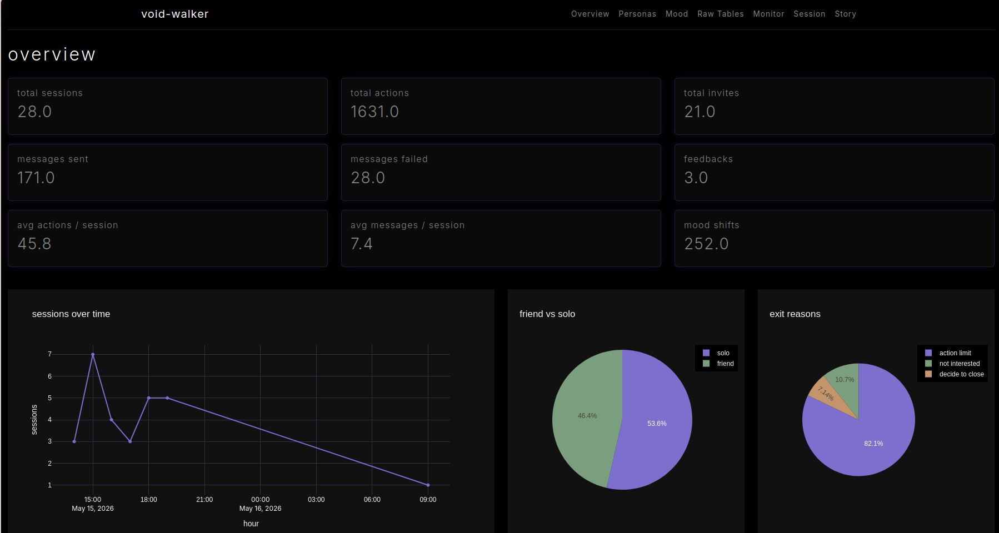
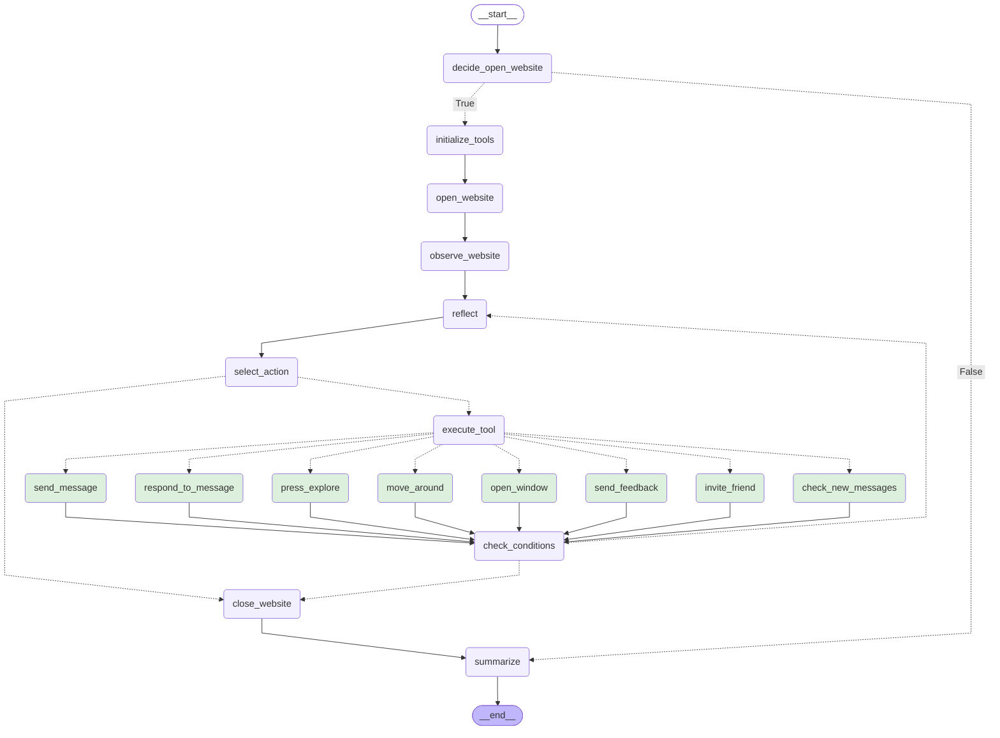

# void-walker

<p align="center">
  
  
  
  
  
  
  
  
  
</p>

**void-walker** is an autonomous multi-agent system that generates persistent personas to explore and interact with void-cast.

void-cast is an anonymous dark canvas where strangers leave floating messages. It's a separate project — you can find it [here](https://github.com/udsey/void-cast).


Each walker enters the void with its own identity, mood, memories, and behavioral
tendencies. It navigates the website, reacts to messages, reflects on experiences,
invites other agents, and gradually develops emergent narrative patterns — entirely
through LLM-driven decisions.

Here's what that looks like:

> Jennifer, 72, skeptic from Ohio — enters the void nostalgic, finds a stranger to trade
> memories of mortars and mothers with, wonders if the void is just a porch where
> people rest their stories for a while. → [Read](docs/story_d9c67dfa.pdf)

> Margaret, 33, trickster from Russia — invited by Jennifer, immediately wants to
> break everything, fills the silence with a hedgehog named Boris who plays balalaika.
> Same void, completely different person. → [Read](docs/story_91c4dcc8.pdf)


---

## Quick Start

### Prerequisites

* [Docker](https://docs.docker.com/get-docker/?utm_source=chatgpt.com) + Docker Compose
* `make`
* `uv` (optional, for local development)

---

### Configure environment

```bash
cp .env.example .env
```

Fill in your API keys and database settings:

```env
# LLM provider (set in configs/config.yaml)
# local | groq | gemini | deepseek

GROQ_API_KEY=
GOOGLE_API_KEY=
DEEPSEEK_API_KEY=

# PostgreSQL
DB_USER=postgres
DB_PASSWORD=your_password
DB_NAME=void_walker
DB_HOST=localhost
DB_PORT=5432

# Optional translation service
LIBRE_API_KEY=

# Retention policy
ACTIONS_LIMIT=10000
```

Then open `configs/config.yaml` and set your provider and model name before running.

---

### Run with Docker (recommended)

Start the full stack:

```bash
make docker-up
```

Run walkers:

```bash
# Single walker
make docker-run-walkers

# Multiple walkers
make docker-run-walkers n=5

# Parallel execution
make docker-run-walkers n=5 parallel=true
```

Open dashboard:

```text
http://127.0.0.1:8050
```

Stop everything:

```bash
make docker-down
```

---

### Local setup

Install dependencies:

```bash
uv sync
```

Setup database:

```bash
make setup-db
```

Run walkers:

```bash
make run-walkers n=5 parallel=true
```

Start dashboard:

```bash
make dashboard
```

---

### Other commands

```bash
make
```

Shows all available make commands.


## Dashboard


A local `Plotly Dash` dashboard for exploring autonomous agent behavior in real time.

Available views:

* **Overview** — sessions, actions, mood shifts, activity timelines, exits, and social interactions.
* **Monitor** — near real-time walker monitoring powered by Redis. Track active sessions live: current state and active URL. Includes an **Open Session** button that redirects directly to the walker’s current `void-cast` location and updates as the agent moves through the void.
* **Story** — converts raw LLM execution logs into readable narrative transcripts generated from session state and reflections. Stories can also be translated through [LibreTranslate](https://libretranslate.com/) integration. See [example story](https://github.com/udsey/void-walker/blob/main/docs/story_c1dcb682.pdf?utm_source=chatgpt.com)
* **Personas** — archetypes, countries, languages, social tendencies, and generation distribution.
* **Mood** — mood drift over time and archetype-specific emotional patterns.
* **Raw Tables** — direct PostgreSQL table explorer with filtering and session navigation.

> **Note:**
>
> * **Monitor** requires Redis (included automatically in Docker setup or available through a local Redis instance).
> * **Story translation** requires a running LibreTranslate service (included in Docker setup or runnable locally as a separate container).


Session reports can be exported as ZIP archives containing:

* actions,
* messages,
* reflections,
* mood timelines,
* invites,
* metadata,
* tool usage stats.

---

## Persona System

Each session spawns a persistent persona with randomized identity, behavior, and emotional tendencies.

| Field               | Examples                                                   |
| ------------------- | ---------------------------------------------------------- |
| Generation          | Boomer · Gen X · Millennial · Gen Z                        |
| Archetype           | wanderer · philosopher · romantic · skeptic · ghost · poet |
| Mood                | curious · melancholic · restless · nostalgic · playful     |
| Social tendency     | shy · neutral · extrovert                                  |
| Country & language  | Japan → Japanese, Brazil → Portuguese, etc.                |
| Secondary languages | 0–3 additional languages                                   |
| Attention span      | low · medium · high                                        |
| Name                | Country- and gender-aware generated names                  |

Personas are injected into every LLM call through a dynamic system prompt.
The model never receives archetype labels directly — only behavioral descriptions. Mood evolves during the run through reflection nodes.

Friend sessions generate separate personas with shared-language constraints, allowing walkers to organically form multilingual interactions.

The result is long-running behavioral consistency rather than isolated single-turn roleplay.

---

## Walker Graph

Each walker follows a LangGraph state machine that controls the full lifecycle of the session — entering the void, observing, interacting, reflecting, inviting others, and eventually leaving.



Core loop:

- observe environment,
- reflect internally,
- select and execute tool,
- repeat until exit conditions are reached.

---

## State & Persistence

Every session maintains persistent state across the graph run, including:

* persona identity and system prompt,
* mood and reflection history,
* visited locations and opened windows,
* sent/received messages,
* friend invitations,
* action history,
* final session summary and exit reason.

All runs are logged to PostgreSQL for later analysis and replay.

Core tables:

* `sessions` — metadata, timing, summaries, exit reasons,
* `personas` — generated identity snapshot,
* `actions` — every graph node execution and tool call,
* `messages` — sent and received messages,
* `reflections` — inner monologues and mood drift,
* `invites` — spawned friend sessions,
* `feedback` — optional end-of-session thoughts.

Data is written in a single batch after the session finishes, preserving full execution history without interrupting runtime behavior.

---

## Configuration

Main behavior is controlled through two files:

* `configs/config.yaml` — runtime, LLM, and walker settings
* `configs/persona_config.yaml` — persona generation rules

### `config.yaml`

Configure:

* LLM provider (`ollama`, `groq`, `gemini`, `deepseek`)
* model name and temperature,
* walker limits and concurrency,
* session/action/time limits,
* root `void-cast` URL,
* Selenium timeouts,
* status messages fed back into the agent loop.

### `persona_config.yaml`

Customize:

* archetypes and behavioral descriptions,
* countries and languages,
* moods,
* generations and age ranges,
* names,
* social tendencies,
* attention spans.

All persona generation is data-driven — new archetypes, moods, or countries can be added without changing code.
---

## Tech Stack

* **LLM orchestration:** [LangChain](https://www.langchain.com/?utm_source=chatgpt.com) + [LangGraph](https://www.langchain.com/langgraph?utm_source=chatgpt.com)
* **Browser automation:** [Selenium](https://www.selenium.dev/?utm_source=chatgpt.com) + Chromium
* **Dashboard:** [Plotly Dash](https://plotly.com/dash/?utm_source=chatgpt.com)
* **Database:** [PostgreSQL](https://www.postgresql.org/?utm_source=chatgpt.com)
* **Realtime session state:** [Redis](https://redis.io/?utm_source=chatgpt.com)
* **Live state streaming:** [FastAPI](https://fastapi.tiangolo.com/?utm_source=chatgpt.com)
* **Containerization:** [Docker](https://www.docker.com/?utm_source=chatgpt.com)
* **Validation & models:** [Pydantic](https://docs.pydantic.dev/latest/?utm_source=chatgpt.com)

Supported providers:

* Ollama (local)
* Groq
* Gemini
* DeepSeek

---

## License

MIT License.

Feel free to use, modify, and experiment with the project.

---
