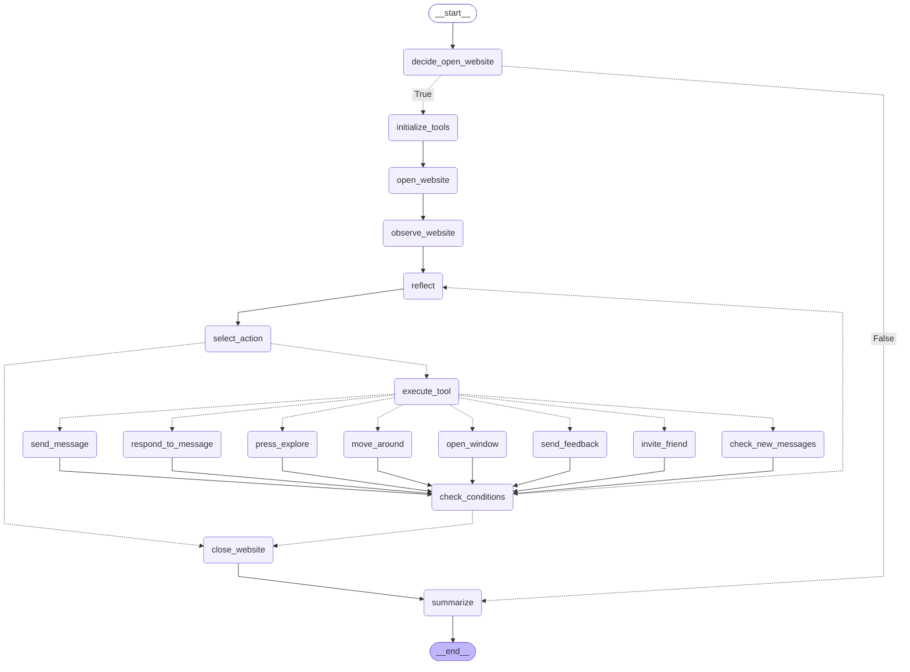

# void-walker

<p align="center">
  
  
  
  

  
  
</p>

**void-walker** is an autonomous agent that generates human-like personas to interact with [void-cast](https://github.com/udsey/void-cast).

Three-in-one: QA tool, content seeder, and LLM behavior observatory. Each session spawns a unique persona that decides whether to enter the void, wanders the canvas, reacts to what it finds, and reflects on the experience — all LLM-driven.

See [example session report](session_example.md) for a sample walker session.

---

## Usage

### Prerequisites

- [Docker](https://docs.docker.com/get-docker/) and Docker Compose installed
- [make](https://www.gnu.org/software/make/) (install if not present — used for convenience commands)
- [uv](https://docs.astral.sh/uv/) package manager (for local setup only)


### Configure environment variables

```bash
cp .env.example .env
```
Edit `.env` and fill in your values:
```env
# LLM Provider Keys (optional - only needed for cloud providers).
# Set model_type in config.yaml: local | groq | gemini | deepseek

GROQ_API_KEY=your_key_here      # Required if using groq model_type
GOOGLE_API_KEY=your_key_here    # Required if using gemini model_type
DEEPSEEK_API_KEY=your_key_here  # Required if using deepseek model_type
# For local (ollama), no API keys needed

# PostgreSQL Database
DB_USER=postgres                # Database user
DB_PASSWORD=your_password       # Database password
DB_NAME=void_walker             # Database name
DB_HOST=localhost               # For local setup only. Docker overrides this automatically.
DB_PORT=5432                    # PostgreSQL default port

# Data Retention
ACTIONS_LIMIT=10000             # Max actions stored in DB. Cron job removes oldest sessions when exceeded
```
---

### Docker Setup (recommended)

**1. Start all containers**
```bash
make docker-up
```
This builds and starts the database, walker, and dashboard containers.

**2. Run walkers**
```bash
# Run 1 walker (default)
make docker-run-walkers

# Run 5 walkers sequentially
make docker-run-walkers n=5

# Run 5 walkers in parallel
make docker-run-walkers n=5 parallel=true
```

**3. View the dashboard**
Open your browser to http://127.0.0.1:8050

**4. Stop the stack**
```bash
make docker-down           # stop containers
make docker-down-volumes   # stop and wipe data
```

**Useful Docker commands**
```bash
make docker-logs            # follow all logs
make docker-logs-db         # follow database logs only
make docker-logs-walker     # follow walker logs only
make docker-logs-dashboard  # follow dashboard logs only
```

### Local Setup (alternative)


**1. Install dependencies**
```bash
uv sync
```

**2. Set up the database**
```bash
make setup-db
```

**3. Run walkers**
```bash
make run-walkers           # 1 walker
make run-walkers n=5       # 5 walkers sequentially
make run-walkers n=5 parallel=true   # 5 walkers in parallel
```

**4. Start the dashboard**
```bash
make dashboard
```
Visit `http://127.0.0.1:8050`

**5. Generate a session report**
```bash
make report session_id=<your_session_id>
```

**Other local commands**
```bash
make recreate-db   # drop and recreate all tables
make drop-db       # drop all tables
```
---

## Dashboard


A local `Plotly Dash` app for exploring session logs. Access it at http://127.0.0.1:8050 after starting the dashboard (see Usage section).


**Overview** — KPI cards (sessions, actions, messages, mood shifts), sessions over time, action distribution, friend vs solo split, exit reasons.

**Session** — Drill into any session: full action timeline with LLM prompts/responses, mood shifts, tool usage stats, and session metadata. Click **download report** to export session data as a zip of CSVs (overview, actions, messages, mood timeline, invites, feedback, tool usage).

**Personas** — World map of persona origins, archetype/generation/social tendency distributions.

**Mood** — Most shifted-into moods and mood timeline by archetype.

**Raw Tables** — Direct view of all database tables with sort/filter. Click any session ID to jump to the session detail page.


---

## Persona System

Each session generates a unique persona composed of randomized traits:

| Field | Options |
|---|---|
| Generation | Boomer · Gen X · Millennial · Gen Z |
| Age | Randomized within generation range (e.g., Millennial: 28-43) |
| Gender | male · female · non-binary |
| Country | Random from 16 countries (US, UK, Japan, Brazil, etc.) |
| Native language | Derived from country (e.g., Japan → Japanese) |
| Secondary languages | 0-3 additional languages from a shared pool of 10 |
| Archetype | wanderer · philosopher · trickster · romantic · skeptic · socialite · ghost · poet |
| Mood | curious · melancholic · restless · euphoric · anxious · bored · nostalgic · playful |
| Social tendency | shy · neutral · extrovert |
| Attention span | low · medium · high |
| Name | Country- and gender-appropriate name from persona config (except friend session) |

Mood can drift over the session in `reflect` node. The system prompt is injected into every LLM call; the archetype key is never passed, only its behavioral description (see `persona_config.yaml` for archetype definitions).

Friend sessions receive a separate randomly assigned persona with two constraints:
- Shares at least one language with the inviting walker (either native or secondary)
- Name is preserved from the invite message (the inviting walker chooses how to address them) — may not match their country or gender

---

## Walker Graph

Each walker follows a LangGraph state machine that controls the session lifecycle — from deciding whether to enter the void, to taking actions, reflecting on outcomes, and finally exiting.



---

## State

Key fields carried through the graph:

| Field | Description |
|---|---|
| `session_id` / `parent_session_id` | Session identity; parent set for friend sessions |
| `name` / `mood` / `system_prompt` | Active persona identity |
| `initial_url` / `current_url` | Navigation tracking |
| `summary` / `reflection` | `reflection`: post-action inner monologue. `summary`: final session summary written at exit (actions taken, messages sent, mood journey, exit reason, etc.) |
| `feedback` | Accumulated end-of-session reflections |
| `is_friend` | Whether this session was spawned by an invite |
| `invited_friends` | List of `FriendInviteModel` — name, shared URL, common language, friend session ID |
| `sent_messages` | Sent messages with content, optional reply target, and timestamp |
| `last_read_messages` | Latest messages visible on the canvas |
| `actions` | Full action log — name, timestamp, LLM prompt/response, function result |
| `opened_windows` | Windows opened during the session |
| `exit_reason` | Why the session ended |

---

## Database Schema


All sessions are logged to a local PostgreSQL database (separate from void-cast). The schema consists of 7 tables with foreign key relationships to `sessions`:

| Table | Description |
|---|---|
| `sessions` | Session identity, model config, URLs, timing, action/invite counts, exit reason, summary, etc. |
| `personas` | Full persona snapshot — age, generation, gender, country, languages, archetype, mood |
| `actions` | Every node execution — name, timestamp, LLM prompt/answer/reason, function result |
| `messages` | Sent and received messages, reply target, messages visible at time of send |
| `reflections` | Per-action mood before/after, inner monologue, mood shift flag |
| `invites` | Invite details — names, common language, shared URL, message, spawned friend session ID |
| `feedback` | Feedback written via the `send_feedback` tool (zero or more per session) |

Data is flushed in a single batch after the session finishes — no database writes occur during the run.

---

## Configuration

### config.yaml

| Section | Description |
|---------|-------------|
| `llm_config` | LLM provider and behavior. `model_type`: `local` (ollama), `groq`, `gemini`, or `deepseek`. `model_name` depends on provider. `temperature`: 0-2 for response randomness |
| `walkers_config` | Session limits. `action_limit`: max actions per session. `time_limit`: max minutes per session. `active_walkers_limit`: number currently running. `total_walkers_limit`: total per `run-walkers` command. `friends_limit`: max friends per session. `verbose`: detailed logging |
| `root_url` | Target void-cast instance URL |
| `status_config` | Maps each tool to success/failure messages fed back to the LLM after action execution |
| `wait_timeout` | Selenium wait timeout in seconds |

### persona_config.yaml

Controls persona randomization. All sections are customizable — add, remove, or edit any field.

| Section | Description |
|---------|-------------|
| `archetypes` | Keys (`ghost`, `philosopher`, etc.) map to behavioral descriptions injected into system prompt. The key itself is never passed to the LLM |
| `countries` | Country code and mother language. Format: `Country: [code, mother_language]` |
| `languages_pool` | Pool of second languages (0-2 randomly assigned) |
| `genders` | `male`, `female`, `non-binary` |
| `generations` | Age ranges. Walker randomizes age within `min`/`max` |
| `moods` | Available moods for persona generation and drift (walkers not forced to choose from it, so during reflection they can add different moods.) |
| `names` | Per-country, per-gender name lists. Friend sessions may override name/language (not gender/country specific) |
| `social_tendencies` | `shy`, `neutral`, `extrovert` |
| `attention_spans` | `low`, `medium`, `high` |

---

## Project Structure

```
├── configs/                         # User-editable configuration
│   ├── config.yaml                  # LLM settings, walker limits, root URL, status messages
│   └── persona_config.yaml          # Archetypes, countries, names, moods, generations
│
├── dashboard/                       # Plotly Dash web app
│   ├── app.py                       # Dash application entry point
│   ├── db.py                        # Database queries for dashboard visualizations
│   ├── styles.py                    # Colors and styles used across dashboard pages
│   ├── pages/                       # Dashboard tabs (overview, session, persona, mood, raw_tables)
│   └── assets/                      # Static assets (CSS)
│
├── src/                             # Core source code
│   ├── db/                          # Database layer
│   │   ├── db.py                    # Database connection (create/drop tables)
│   │   ├── db_writer.py             # Batch writer for logging graph runs
│   │   ├── utils.py                 # generate_report() for session exports (make report)
│   │   └── sql/                     # SQL schemas and views (see Database Schema)
│   │
│   ├── selenium/                    # Browser automation
│   │   ├── helpers.py               # All automation functions
│   │   └── utils.py                 # Development helpers (e.g., highlight element on page)
│   │
│   ├── walker/                      # LangGraph agent core
│   │   ├── walker.py                # Walker class — graph nodes and flow (excluding tools)
│   │   ├── tools.py                 # Walker tools (send_message, move_around, etc.)
│   │   ├── persona.py               # Persona generation logic
│   │   ├── run.py                   # run_walkers() (number of walkers, parallel/sequential)
│   │   └── utils.py                 # Helpers: wrappers, name-to-function maps, llm_call
│   │
│   ├── models.py                    # Pydantic models
│   └── setup.py                     # Load configs, .env, set BASE_DIR etc.
│
├── data/                            # Auto-created. Stores exported session reports (make report)
│
├── compose.yaml                     # Docker Compose (db, walker, dashboard services with healthchecks)
├── Dockerfile.db                    # PostgreSQL with pg_cron and retention policy (ACTIONS_LIMIT)
├── Dockerfile.walker                # Walker container — Chromium + dependencies, runs with WALKERS_N/PARALLEL
├── Dockerfile.dashboard             # Dashboard container — serves Dash app on port 8050
├── makefile                         # All make commands (run-walkers, docker-up, report, etc.)
├── pyproject.toml                   # Python dependencies and project metadata
├── uv.lock                          # Locked dependency versions
└── README.md
```

**Key modules:**

- `src/walker/` — LangGraph state machine.
- `src/selenium/` — Browser automation.
- `src/db/` — DB logic.
- `dashboard/` — Standalone Dash app.
