# void-walker

  
  
  
  
  
  

**void-walker** is an autonomous agent that generates human-like personas to interact with [void-cast](https://github.com/udsey/void-cast).

Three-in-one: QA tool, content seeder, and LLM behavior observatory. Each session spawns a unique persona that decides whether to enter the void, wanders the canvas, reacts to what it finds, and reflects on the experience — all LLM-driven.

---

## Architecture

```mermaid
---
config:
  flowchart:
    curve: linear
---
graph LR;
	__start__([<p>__start__</p>]):::first
	check_conditions(check_conditions)
	close_website(close_website)
	decide_open_website(decide_open_website)
	execute_tool(execute_tool)
	initialize_tools(initialize_tools)
	observe_website(observe_website)
	open_website(open_website)
	reflect(reflect)
	select_action(select_action)
	summarize(summarize)
	__end__([<p>__end__</p>]):::last
	__start__ --> decide_open_website;
	check_conditions -.-> close_website;
	check_conditions -.-> reflect;
	close_website --> summarize;
	decide_open_website -. &nbsp;True&nbsp; .-> initialize_tools;
	decide_open_website -. &nbsp;False&nbsp; .-> summarize;
	execute_tool --> check_conditions;
	initialize_tools --> open_website;
	observe_website --> reflect;
	open_website --> observe_website;
	reflect --> select_action;
	select_action -.-> close_website;
	select_action -.-> execute_tool;
	summarize --> __end__;
	classDef default fill:#f2f0ff,line-height:1.2
	classDef first fill-opacity:0
	classDef last fill:#bfb6fc
```

---

## Persona System

Each session generates a unique persona composed of randomized traits:

| Field | Options |
|---|---|
| Generation | Boomer · Gen X · Millennial · Gen Z |
| Country + Language | Random, language derived from country |
| Archetype | wanderer · philosopher · trickster · romantic · skeptic · socialite · ghost · poet |
| Mood | curious · melancholic · restless · euphoric · anxious · bored · nostalgic · playful |
| Social tendency | shy · neutral · extrovert |
| Attention span | low · medium · high |

Mood can drift over the session via the `reflect` node.

Friend sessions receive a separate randomly assigned persona — guaranteed to share a common language with the inviting walker — and an additional entry decision: open or ignore the invite.

---

## State

Key fields carried through the graph:

## State

Key fields carried through the graph:

| Field | Description |
|---|---|
| `session_id` / `parent_session_id` | Session identity; parent set for friend sessions |
| `name` / `mood` / `system_prompt` | Active persona identity |
| `initial_url` / `current_url` | Navigation tracking |
| `summary` / `reflection` | Episodic memory and post-action inner monologue, written in persona voice |
| `feedback` | Accumulated end-of-session reflections |
| `is_friend` | Whether this session was spawned by an invite |
| `invited_friends` | List of `FriendInviteModel` — name, shared URL, common language, friend session ID |
| `sent_messages` | Sent messages with content, optional reply target, and timestamp |
| `last_read_messages` | Latest messages visible on the canvas |
| `actions` | Full action log — name, timestamp, LLM prompt/response, function result |
| `opened_windows` | Windows opened during the session |
| `exit_reason` | Why the session ended |

---

## Logging

All sessions are logged to a local PostgreSQL database (separate from void-cast):

| Table | Description |
|---|---|
| `sessions` | Identity, model config, URLs, timing, action/invite counts, exit reason |
| `personas` | Full persona snapshot — age, generation, gender, country, languages, archetype, mood |
| `actions` | Every node execution — name, timestamp, LLM prompt/answer/reason, function result |
| `messages` | Sent and received messages, reply target, messages visible at time of send |
| `reflections` | Per-action mood before/after, inner monologue, mood shift flag |
| `invites` | Invite details — names, common language, shared URL, message, spawned friend session ID |
| `feedback` | End-of-session reflections written into the void |

---

## Dashboard

A local [Plotly Dash](https://dash.plotly.com/) app for exploring session logs.

**Overview** — KPI cards (sessions, actions, messages, mood shifts), sessions over time, action distribution, avg session duration by archetype, exit reasons, friend vs solo split.

**Session** — drill into any session: full action timeline, mood shifts, messages sent/received, invites, tool usage stats, feedback. Exportable as a zip of CSVs.

**Personas** — world map of persona origins, archetype/generation/social tendency distributions.

**Mood** — Sankey diagram of mood transitions, most shifted-into moods, mood timeline by archetype.

**Raw Tables** — direct view of all DB tables with sort/filter. Session IDs link directly to the session detail page.